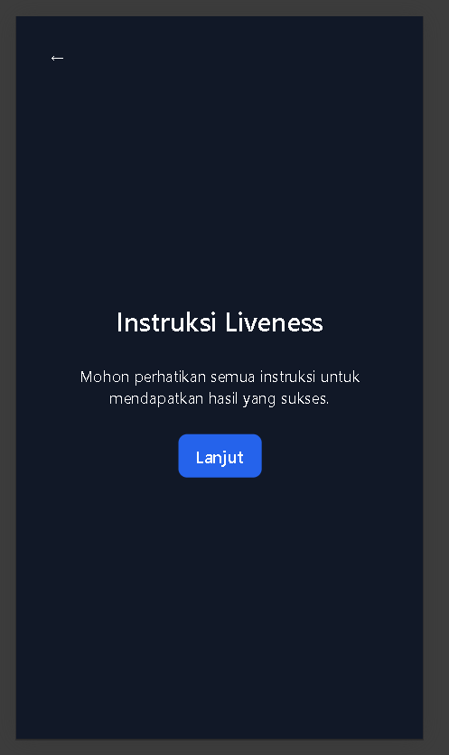
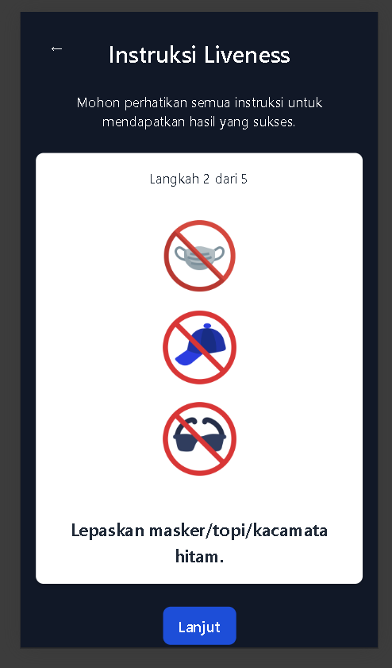
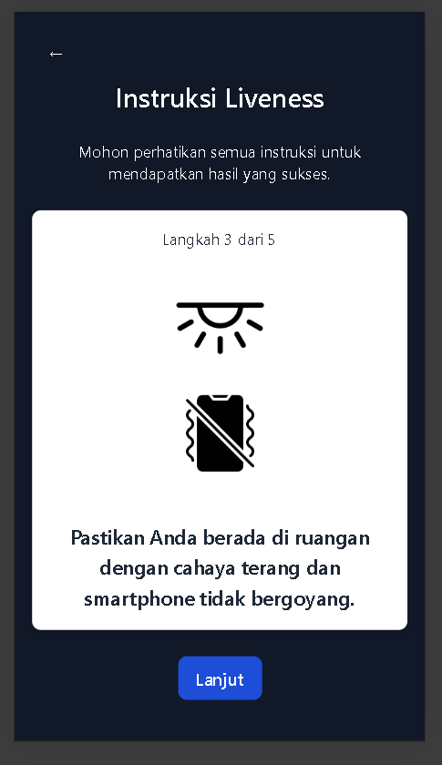
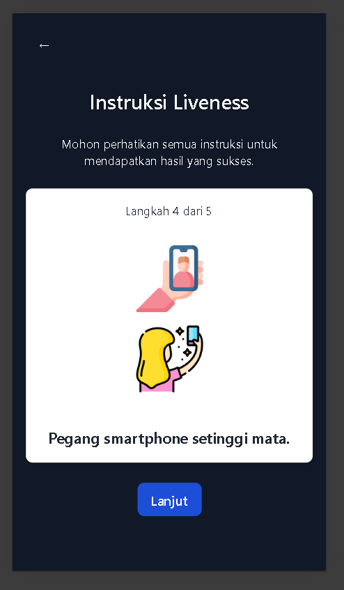
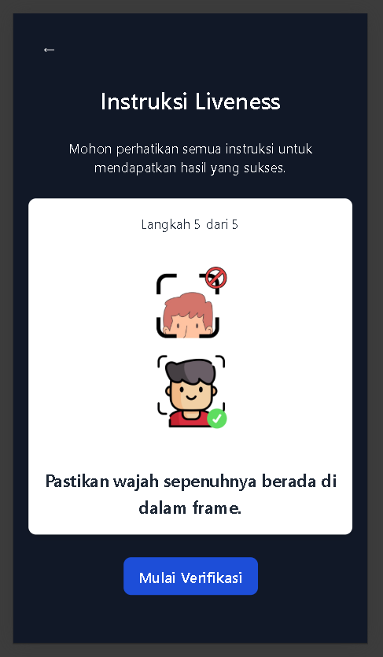
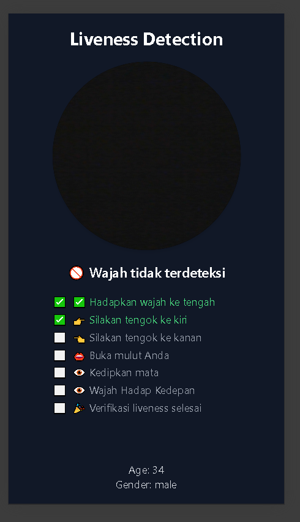

# Liveness web base on React + TypeScript + Vite + Human.js

# Sample

# Instructions (are provided with sound)






# Liveness selfie


# How to start
```js
npm install
npm run dev
```
# Live Demo
```js
https://liveness-web-zeta.vercel.app/
```

Currently, This project provides a:
- FE proccess only, no need BE
- No SDK needed
- Secure, No expose confidential image
- Customize
- Open Source